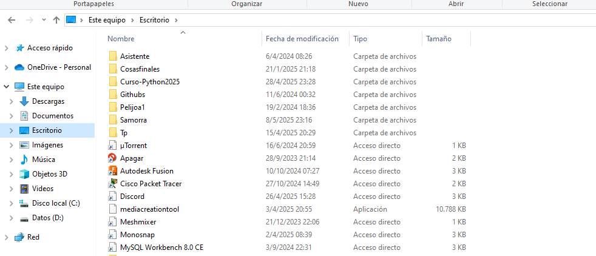
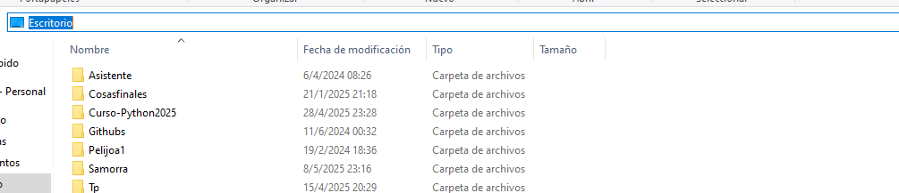
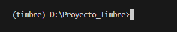

## El primer paso para poder tener el  repostiositorio es clonarlo 

# Pero antes hay que descargar git 
https://git-scm.com/

# Y a la vez tener una cuenta de git hub
Video para descargar git 
https://www.youtube.com/watch?v=jdXKwLNUfmg

# Una vez descargado git y tener una  cuenta de git hub  se hace una  git clone del repositorio 
Pero antes de  eso se tiene que abrir el cmd o entrar a algun lugar donde va a estar el proyecto 
por ejemplo 
si se quiere poner en el escritorio se abre el explorador y se apreta donde esta el escritorio 

# Luego se tiene que modificar esta parte 
 
Y una vez echo esto en ese lugar se tiene que escribir cmd 
y luego va a aparecer una consola negra y se empieza a poner 
git clone https://github.com/Back-Nova/Timbre.git

Pero puede ser que en el momento le aparezca crear una cuenta en git hub  si no tiene una se la tiene que crear pero si ya tiene solamente  tiene que esperar unos segundos para que aparezca en su carpeta

Una vez que ya tenga  todo 
lo va a abrir en el visual y tiene que tener instalado python 
y de extension tiene que tener pylance y python 

## Una vez ya tenga todo se va a dirigir a crear un entorno virtual en la terminal de esta manera
python -m venv (aca es el nombre del entorno)

python -m venv timbre
y una vez creado el entorno va a activarlo  esta manera
timbre\Scripts\activate  Esto tiene que ponerlo en la terminal y con esto activara el entorno 
y le va a aparecer asi 

Y una vez echo esto tendra que instalar las librerias para el proyecto poniendo esto 

pip install -r requirements.txt

Y una vez descargado todo tendra que hacer esto 
python app.py 
apreta enter y con esto podra ver la pagina

